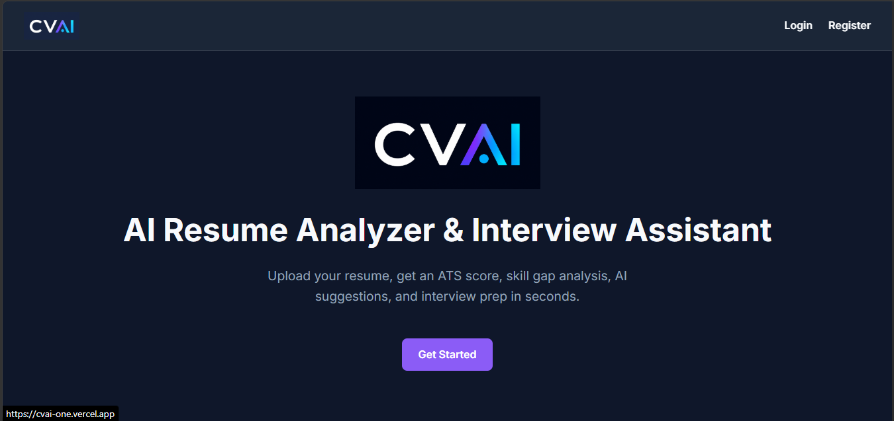
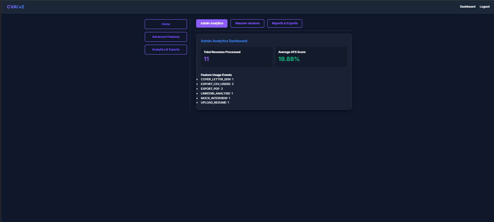
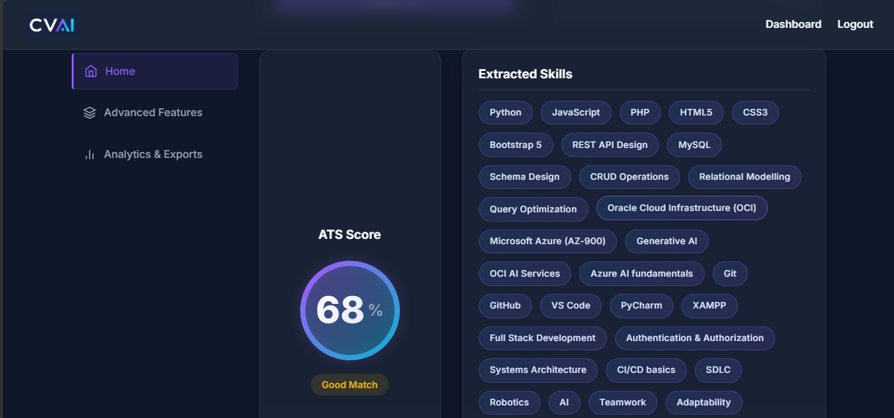
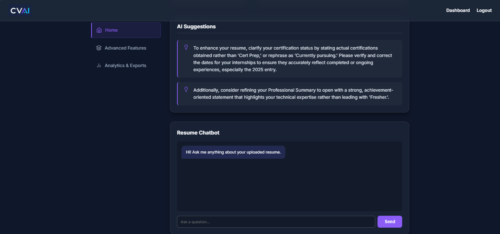
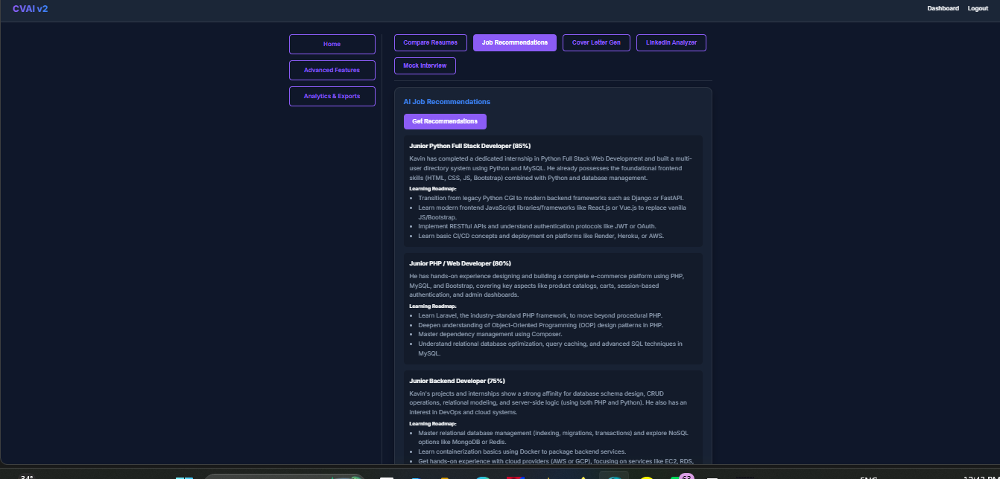
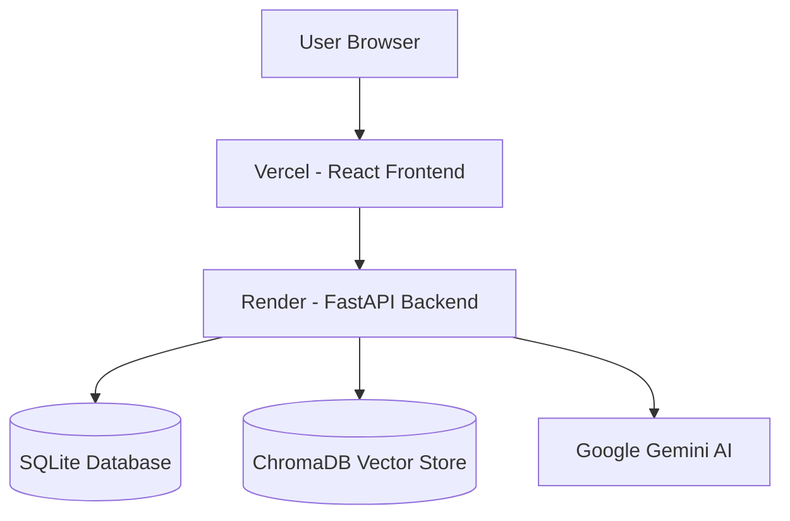

# CVAI - AI Resume Analyzer & Interview Assistant

CVAI is a full-stack AI-powered Resume Analyzer and Interview Assistant built using React, FastAPI, Google Gemini AI, ChromaDB, and modern DevOps practices. The platform helps job seekers analyze resumes, improve ATS compatibility, identify skill gaps, prepare for interviews, and receive AI-powered career guidance.

## Live Demo

Frontend: https://cvai-one.vercel.app

Backend API: https://cvai-cws9.onrender.com

API Documentation: https://cvai-cws9.onrender.com/docs

## Screenshots

## Features

### Resume Analysis

* ATS Score Calculation
* Resume Parsing and Skill Extraction
* Missing Skill Detection
* Job Description Matching
* AI Resume Improvement Suggestions

### AI Features

* Google Gemini AI Integration
* Resume RAG Chatbot
* Cover Letter Generator
* LinkedIn Profile Analyzer
* Mock Interview Assistant
* Personalized Job Recommendations

### Analytics & Administration

* Admin Dashboard
* Resume Version Tracking
* Usage Analytics
* PDF Export Reports
* CSV Export Functionality
* Role-Based Access Control (RBAC)

### Security

* JWT Authentication
* Refresh Tokens
* Rate Limiting
* Secure File Upload Validation
* Protected Admin Routes

### DevOps

* Dockerized Architecture
* GitHub Actions CI/CD
* Vercel Deployment
* Render Deployment
* Environment Variable Management

## Architecture

## Tech Stack

**Frontend**

* React
* Vite
* JavaScript
* CSS

**Backend**

* FastAPI
* Python 3.11
* SQLAlchemy

**AI**

* Google Gemini AI
* ChromaDB

**Database**

* SQLite

**DevOps**

* Docker
* GitHub Actions
* Vercel
* Render

## Deployment Readiness

* Backend APIs Passed: 18/18
* Frontend Components Passed: 10/10
* Deployment Readiness Score: 100/100

## Developer

Kavin Vijayakumar

GitHub: https://github.com/Kavinvk007

LinkedIn: https://www.linkedin.com/in/kavin-vk-3a6090315

