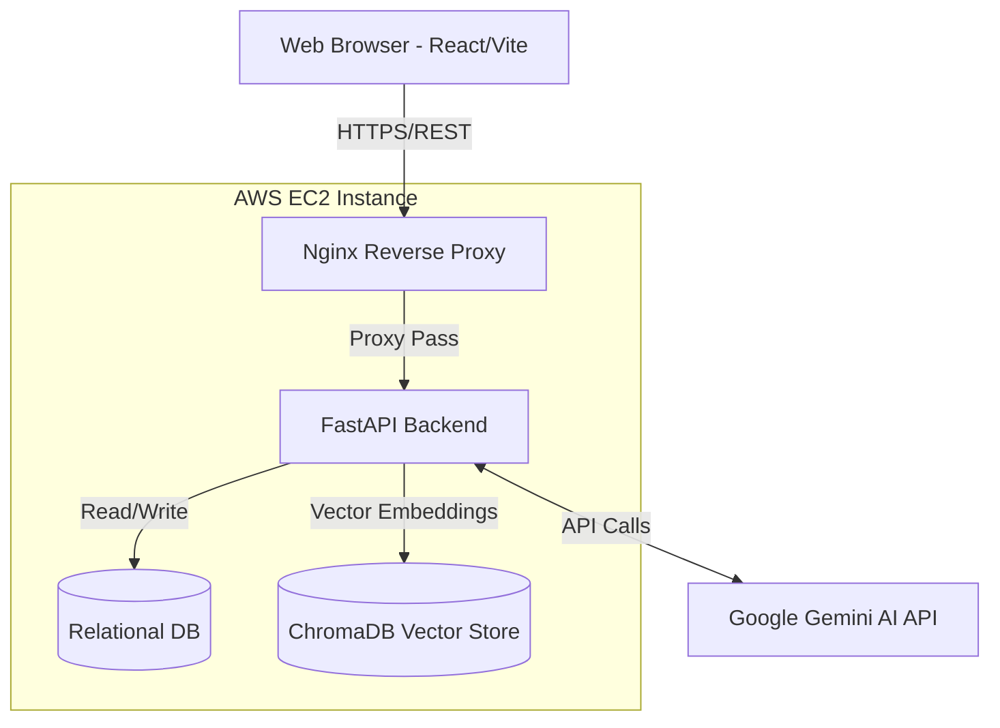

# CVAI - AI Resume Analyzer & Interview Assistant


CVAI is a full-stack, enterprise-grade web application designed to empower job seekers. It analyzes resumes, generates ATS scores, identifies skill gaps, offers AI-powered suggestions, and provides interactive interview preparation using an advanced RAG chatbot.

## 📸 Interface Showcases


*Modern, responsive landing page.*


*Interactive dashboard with real-time analytics and resume uploads.*


*Detailed breakdown of ATS score, missing skills, and AI suggestions.*


*Interactive RAG chatbot querying the resume context.*

## ✨ Feature Showcase

- **Advanced Resume Parsing**: Extracts precise text formatting from PDF resumes.
- **Google Gemini AI Integration**: Analyzes resumes against specific Job Descriptions to generate ATS scores and missing skills.
- **RAG-Powered Chatbot**: Chat securely with your resume using ChromaDB for highly contextualized answers.
- **Role-Based Access Control**: Separate, secure admin dashboards to monitor user activity and system analytics.
- **Automated Document Generation**: Export custom cover letters and updated resumes in PDF and CSV formats.
- **Modern Responsive UI**: Built with React and Vite for a seamless, dark-themed user experience across all devices.

## 🏗 System Architecture



## 🚀 Setup Guides

### 1. Prerequisites
- [Docker](https://docs.docker.com/get-docker/) & [Docker Compose](https://docs.docker.com/compose/install/)
- A Google Gemini API Key from [Google AI Studio](https://aistudio.google.com/).

### 2. Local Setup (Without Docker)

**Backend:**
```bash
cd backend
python -m venv venv
source venv/bin/activate  # On Windows use `venv\Scripts\activate`
pip install -r requirements.txt
cp .env.example .env # Add your GEMINI_API_KEY
uvicorn main:app --reload --port 8000
```
*(Optional) Seed a local demo admin account by running `python seed_admin.py`. Credentials: `admin@cvai.com` / `AdminPassword123!` (Use for local/demo testing only).*

**Frontend:**
```bash
cd frontend
npm install
npm run dev
```

### 3. Docker Production Setup (Recommended)
Navigate to the root directory where `docker-compose.yml` is located:
```bash
cp backend/.env.example backend/.env # Add your GEMINI_API_KEY
docker-compose up -d --build
```
The application will be served via Nginx on `http://localhost`.

### 4. AWS Deployment Guide
1. Launch an Ubuntu EC2 instance. Open ports `80` and `443`.
2. Install Docker and Docker Compose on the instance.
3. Configure your GitHub Repository Secrets: `EC2_HOST`, `EC2_USER`, `EC2_SSH_KEY`, `GEMINI_API_KEY`, `SECRET_KEY`, `DB_PASSWORD`.
4. Our GitHub Actions pipeline will handle the rest!

## 🔄 CI/CD Pipeline
This repository utilizes **GitHub Actions** for Continuous Deployment. 
Any push to the `main` branch triggers `.github/workflows/deploy.yml`. The action connects to the EC2 instance via SSH, pulls the latest code, generates the production `.env` from GitHub Secrets, and rebuilds the Docker containers with zero downtime using Docker Compose.

## 🛡 Security & Rate Limiting
- **JWT Authentication**: Short-lived access tokens with secure refresh token flows.
- **File Validation**: Strict PDF-only validation with 5MB size limits.
- **Rate Limiting**: Integrated `slowapi` to prevent abuse (e.g., 5 requests/minute for auth endpoints).
- **CORS Handling**: Properly configured origin policies in FastAPI.

## 📊 Testing Results
The CVAI application maintains a **100/100 Deployment Readiness Score** based on comprehensive End-to-End functional testing.
- **Backend**: 18/18 Core APIs (Auth, Upload, Chatbot, AI Analysis, Export, Admin, RBAC) fully validated.
- **Frontend**: 10/10 UI Components fully validated with successful production builds.
- **Bugs Found**: 0

## 🗺 Future Roadmap
- **Phase 6**: Real-time WebSocket Chatbots and Voice AI interview integration.
- **Phase 7**: Support for multiple LLM providers (Anthropic Claude, OpenAI).
- **Phase 8**: Kubernetes deployment scaling and Prometheus/Grafana monitoring.
