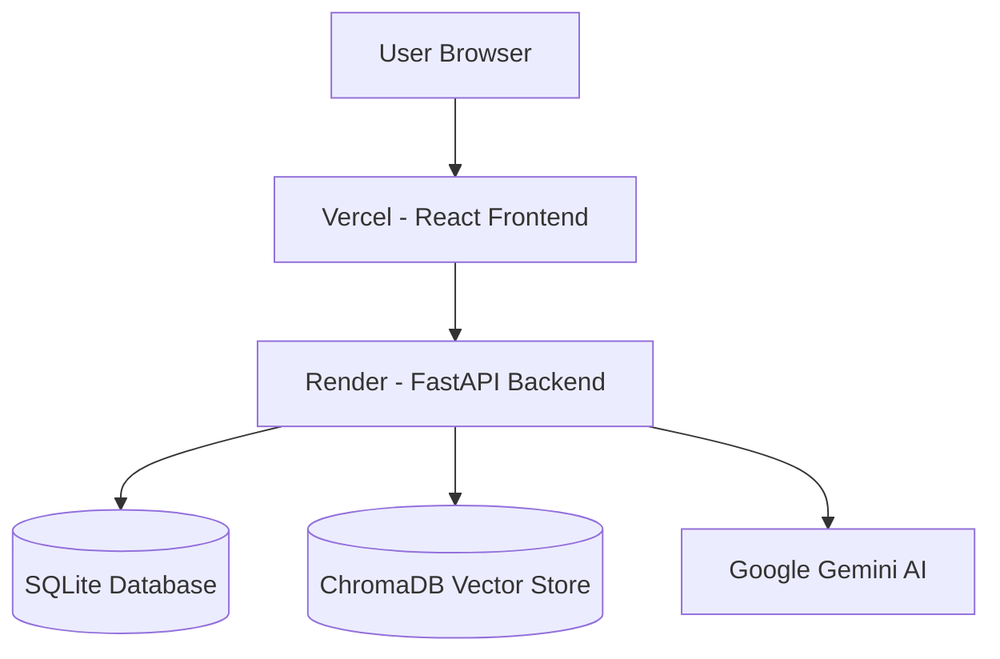

# CVAI - AI Resume Analyzer & Interview Assistant

\

CVAI is a full-stack AI-powered Resume Analyzer and Interview Assistant built using React, FastAPI, Google Gemini AI, ChromaDB, and modern DevOps practices. The platform helps job seekers analyze resumes, improve ATS compatibility, identify skill gaps, prepare for interviews, generate cover letters, receive AI-powered job recommendations, and gain career insights through an intelligent AI assistant.

---

## Live Demo

**Frontend:** https://cvai-one.vercel.app

**Backend API:** https://cvai-cws9.onrender.com

**API Documentation:** https://cvai-cws9.onrender.com/docs

---

## Screenshots

### Landing Page

### Analytics Dashboard

### ATS Analysis

### Resume Chatbot

### Job Recommendations

---

## Key Highlights

* AI-powered ATS Resume Analysis
* Resume Skill Gap Detection
* Personalized Job Recommendations
* Resume RAG Chatbot
* AI Cover Letter Generator
* LinkedIn Profile Analyzer
* AI Mock Interview Assistant
* Resume Version Tracking
* Admin Analytics Dashboard
* JWT Authentication & RBAC
* Dockerized Deployment Pipeline
* CI/CD with GitHub Actions
* Responsive SaaS-style User Interface

---

## Features

### Resume Analysis

* ATS Score Calculation
* Resume Parsing & Skill Extraction
* Missing Skill Detection
* Job Description Matching
* AI Resume Improvement Suggestions

### AI Features

* Google Gemini AI Integration
* Resume RAG Chatbot
* Cover Letter Generator
* LinkedIn Profile Analyzer
* AI Mock Interview Assistant
* Personalized Job Recommendations

### Analytics & Administration

* Admin Dashboard
* Resume Version Tracking
* Usage Analytics
* PDF Export Reports
* CSV Export Functionality
* Role-Based Access Control (RBAC)

### Security

* JWT Authentication
* Refresh Tokens
* Rate Limiting
* Secure File Upload Validation
* Protected Admin Routes

### DevOps

* Dockerized Architecture
* GitHub Actions CI/CD
* Vercel Deployment
* Render Deployment
* Environment Variable Management

---

## Architecture

## Tech Stack

### Frontend

* React
* Vite
* JavaScript
* CSS3
* Axios

### Backend

* FastAPI
* Python 3.11
* SQLAlchemy
* JWT Authentication

### AI & Machine Learning

* Google Gemini AI
* ChromaDB
* RAG (Retrieval Augmented Generation)

### Database

* SQLite

### DevOps & Deployment

* Docker
* GitHub Actions
* Vercel
* Render

---

## Deployment Readiness

| Category              | Status       |
| --------------------- | ------------ |
| Backend APIs          | 18/18 Passed |
| Frontend Components   | 10/10 Passed |
| Deployment Readiness  | 100/100      |
| Production Deployment | Completed    |
| Mobile Responsive UI  | Completed    |

---

## Project Status

 Production Deployed

 Frontend Hosted on Vercel

 Backend Hosted on Render

 Responsive SaaS UI

 AI-Powered Career Assistant

 Portfolio Ready

---

## Future Enhancements

* Real-Time Job Search Integration
* Voice-Based Mock Interviews
* Resume Builder
* AI Portfolio Generator
* LinkedIn Auto Optimization
* AI Career Roadmap Generator

---

## Developer

### Kavin Vijayakumar

GitHub: https://github.com/Kavinvk007

LinkedIn: https://www.linkedin.com/in/kavin-vk-3a6090315

---

 If you found this project useful, consider giving it a star on GitHub!
